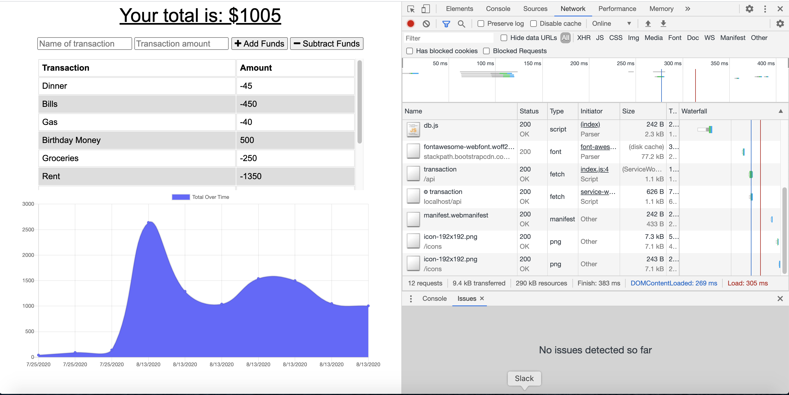
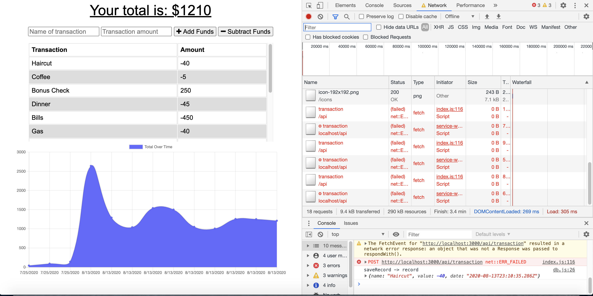
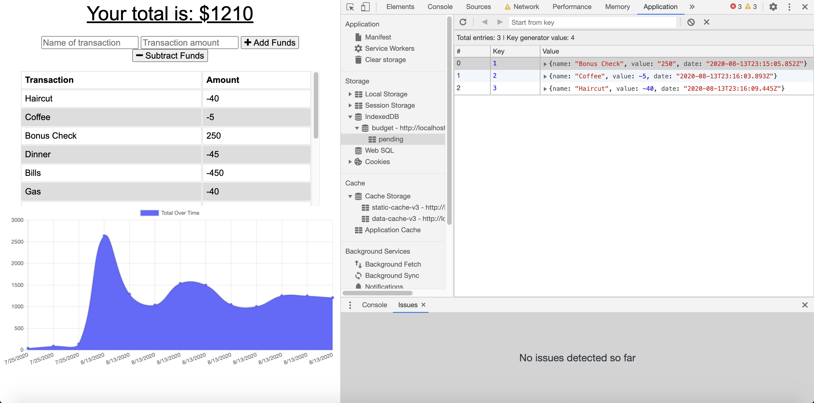

# Budget Tracker App
    

## Description
​This PWA serves as a budget tracker where the user can input a type of deposit or expense to an overall budget and the app will respond with a graphic of the cumulative budget amount. The key functionality that has been added to this app is the ability to allow for offline access when there isn't a network connection. Once the user is out from offline mode and back onto a network connection, all of the offline entries will be added to the tracker. 

## Table of Contents 

* [Screenshot](#screenshot)

* [Prerequisites](#prerequisites)

* [Installation](#installation)

* [Usage](#usage)

* [License](#license)

* [Contributing](#contributing)
​
* [Questions](#questions)

## Screenshot



## Prerequisites

* [Node.js](https://nodejs.dev/)

## Installation

You can clone the repository remotely with the following command line

```
git clone https://github.com/mmoncayo/budget-tracker.git
```

The below steps would be for if you'd like to install the app locally, and if so, you can navigate to the 'budget-tracker' directory and then follow the next steps:

To install the necessary and relevant dependencies using Node.js, run the following command:

```
npm install
```

## Usage

You can then run the following command and then go to your browser and enter: ```https://localhost:3000```

```
node server.js
```

Once you've accessed the app locally on your browser, you can begin navigating through the page by adding expenses or deposits and you'll see the overall budget tracker change based on the cumulative amounts entered. 

The key takeaway advantage of this app is having the capability and functionality to still operate the app when offline. To simulate an offline connection, you want to be sure you're using Google Chrome as your browser, then right click to navigate to the Web Dev Tools page and under the Network tab change your network mode from "Online" to "Offline". 



You can confirm the app is working when offline by some of the console log messages embedded showing so and in the IndexedDB where all the items entered are stored while offline.



## License

This project is licensed under the MIT license.

## Contributing

If you'd like to contribute to the repo, there is interest in future development in major areas for an easier UI experience, updating older budgets, etc.

If interested in contributing, please reach out via GitHub to discuss your input.

## Questions

If you have any questions about the repo, open an issue or contact [mmoncayo](https://github.com/mmoncayo) directly at matthew.moncayo@gmail.com.
